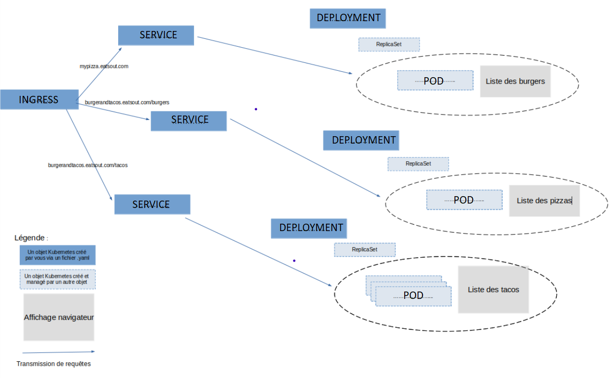

## Question 3 : Compléter le schéma suivant avec des objets Kubernetes



## Question 4 : Builder et publier (à partir de l’image nginx) sur le DockerHub, une image docker pour chacun des sites web présent sur le schéma précédent. Vous devez avoir 3 images (une par magasin tacos, pizzas et burgers)

```bash
docker build -t william/pizza:1.0.0 .
docker tag william/pizza:1.0.0 william/pizza:1.0.0-release
docker push william/pizza:1.0.0-release
```

```bash
docker build -t william/burger:1.0.0 .
docker tag william/burger:1.0.0 william/burger:1.0.0-release
docker push william/burger:1.0.0-release
```

```bash
docker build -t william/tacos:1.0.0 .
docker tag william/tacos:1.0.0 william/tacos:1.0.0-release
docker push william/tacos:1.0.0-release
```

## Question 5 : Ecrire les fichiers yaml vous permettant de déployer sur votre cluster kind installé en local les composants décrits sur le schéma de la question 3 et les images crées à la question 4

```yaml
apiVersion: apps/v1
kind: Deployment
metadata:
  name: mypizza-eatsout-pizza-deployment
  labels:
    app: mypizza-eatsout-pizza
spec:
  replicas: 1
  selector:
    matchLabels:
      app: mypizza-eatsout-pizza
  template:
    metadata:
      labels:
        app: mypizza-eatsout-pizza
    spec:
      containers:
        - name: mypizza-eatsout-pizza
          image: william/pizza:1.0.0-release
          ports:
            - containerPort: 80
---
apiVersion: v1
kind: Service
metadata:
  name: mypizza-eatsout-pizza-service
spec:
  selector:
    app: mypizza-eatsout-pizza
  ports:
    - name: mypizza-eatsout-pizza-service-port
      protocol: TCP
      port: 80
      targetPort: 80
```

```yaml
apiVersion: apps/v1
kind: Deployment
metadata:
  name: mypizza-eatsout-tacos-deployment
  labels:
    app: mypizza-eatsout-tacos
spec:
  replicas: 3
  selector:
    matchLabels:
      app: mypizza-eatsout-tacos
  template:
    metadata:
      labels:
        app: mypizza-eatsout-tacos
    spec:
      containers:
        - name: mypizza-eatsout-tacos
          image: william/tacos:1.0.0-release
          ports:
            - containerPort: 80
---
apiVersion: v1
kind: Service
metadata:
  name: mypizza-eatsout-tacos-service
spec:
  selector:
    app: mypizza-eatsout-tacos
  ports:
    - name: mypizza-eatsout-tacos-service-port
      protocol: TCP
      port: 80
      targetPort: 80
```

```yaml
apiVersion: apps/v1
kind: Deployment
metadata:
  name: mypizza-eatsout-burger-deployment
  labels:
    app: mypizza-eatsout-burger
spec:
  replicas: 1
  selector:
    matchLabels:
      app: mypizza-eatsout-burger
  template:
    metadata:
      labels:
        app: mypizza-eatsout-burger
    spec:
      containers:
        - name: mypizza-eatsout-burger
          image: william/burger:1.0.0-release
          ports:
            - containerPort: 80
---
apiVersion: v1
kind: Service
metadata:
  name: mypizza-eatsout-burger-service
spec:
  selector:
    app: mypizza-eatsout-burger
  ports:
    - name: mypizza-eatsout-burger-service-port
      protocol: TCP
      port: 80
      targetPort: 80
```

```yaml
apiVersion: networking.k8s.io/v1
kind: Ingress
metadata:
  name: mypizza-eatsout-ingress
  annotations:
    nginx.ingress.kubernetes.io/rewrite-target: /
spec:
  ingressClassName: nginx-mypizza-eatsout
  rules:
    - host: localhost
      http:
        paths:
          - path: /
            pathType: Prefix
            backend:
              service:
                name: mypizza-eatsout-pizza-service
                port:
                  number: 80
          - path: /burger
            pathType: Prefix
            backend:
              service:
                name: mypizza-eatsout-burger-service
                port:
                  number: 80
          - path: /tacos
            pathType: Prefix
            backend:
              service:
                name: mypizza-eatsout-tacos-service
                port:
                  number: 80
```

## Question 6 Votre magasin de tacos devient très populaire (il va avoir 3 fois plus de commandes). Il va vous falloir gérer une charge importante sur le Service de commande des tacos. Comment gérez-vous cela ? Comment vérifier que les requêtes sont bien réparties (avec quelle commande kubectl ?) ?

Pour gérer la charge trois fois plus importante sur le service de commande des Tacos il faut "scaler" le déploiement. Pour faire ça, je passe le nombre de "replicas" à trois dans mon déploiement dédié au service de tacos :

```yaml
apiVersion: apps/v1
kind: Deployment
metadata:
  name: mypizza-eatsout-tacos-deployment
  labels:
    app: mypizza-eatsout-tacos
spec:
  replicas: 3
  selector:
    matchLabels:
      app: mypizza-eatsout-tacos
  template:
    metadata:
      labels:
        app: mypizza-eatsout-tacos
    spec:
      containers:
        - name: mypizza-eatsout-tacos
          image: william/tacos:1.0.0-release
          ports:
            - containerPort: 80
```

Pour vérifier que les requêtes sont bien réparties, je peux utiliser la commande "describe" :

```bash
kubectl describe deployment mypizza-eatsout-tacos-deployment
```
